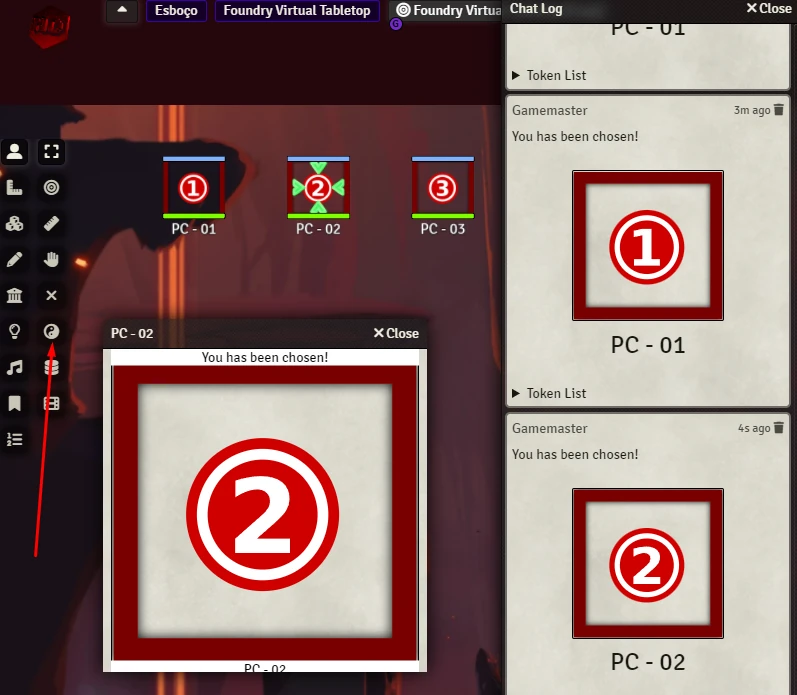

# ☯ Wheel of Destiny 
Select a random token in the scene.

Something bad is about to happen to someone in the room. But, you don't want to be the responsible for it. Let the **Wheel of Destiny** spin. It wasn't your fault, it was the damn computer.

<p align="center">
  
</p>

# Features
- You can select a group of tokens and the module will pick one for you.
- If you don't select any token, the module will read all tokens in the scene. There are some options to modify this behavior.
- The select token will be display in the chat or a dialog.
- You can pick a folder with sounds. Then, one random sound will be played when you run the wheel.
- You can target and pan to the token.
- Sequencer Module: There will be an roulete animation played over the tokens.
- Share Media Module: You can trigger a fullscreen image/video to hide the select token.

# How To
You need to choose a group of options that suit your goal. 

Examples:
- Just send a chat whisper to GM
- Roulete and chat whisper to GM

## Macros and Integration
You can trigger Wheel of Destiny with the following code. This can be used by macros/modules.

### This do same as trigger the button or shortcut.
```js
  window.game.wod.randomToken();
```

### You can pass a custom token list. It'll return the selected token. All WoD features will be triggered.
```js  
  const mySelectedToken = window.game.wod.randomToken(customTokenList=[]);
```

### You can pass a custom token list. It'll return the selected token.
```js  
  const mySelectedToken = window.game.wod.selectRandomToken(tokens=[]);
```
  
## Keybindings
You can use keybindings to trigger too. Use **F**. You can change it on **Controls**.

# Instalation
You can install this module using the manifest: https://raw.githubusercontent.com/brunocalado/wheel_of_destiny/main/module.json

# Community
- Do you have something to improve this module? [Share it!](https://github.com/brunocalado/wheel_of_destiny/issues)
- Do you find out a bug? [Report it!](https://github.com/brunocalado/wheel_of_destiny/issues)

# Changes
You can see changes at [CHANGELOG](CHANGELOG.md).

# Acknowledgements
- JB2A: https://jb2a.com/
- Roll of Fate module. R.I.P.
- Sequencer module.
- Share Media module.
- @PepijnMC 

# License
- Code license at [LICENSE](LICENSE.md).
- Assets license at [LICENSE](LICENSE_ASSETS.md).
