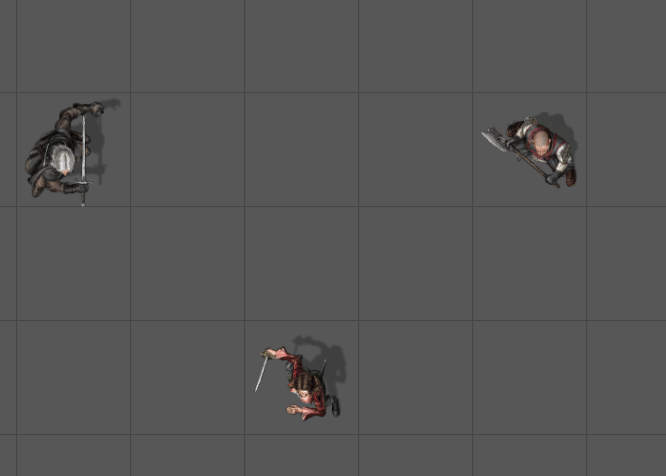
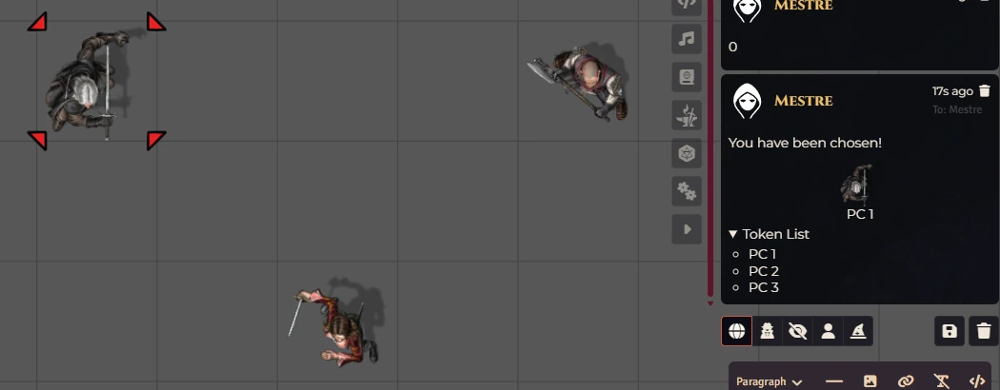
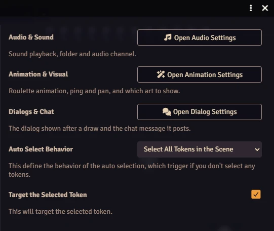

# ☯ Wheel of Destiny

**Let fate pick the victim.**

Something bad is about to happen to someone in the room. But you don't want to be the one who chose. Let the **Wheel of Destiny** spin. It wasn't your fault — it was the damn computer.

One click, and the module randomly picks a token: it glows on the canvas, the wheel spins, a sound plays, and the chosen one is revealed to the whole table.

<p align="center">
  
</p>

[](https://buymeacoffee.com/mestredigital) [](https://mestredigital.online/pages/projetos-en)

## ✨ What It Does

- 🎯 **Picks a random token for you.** Select a few tokens and it draws from those. Select nothing and it draws from the whole scene — or only the PCs, only the friendlies, or only the hostiles. Your call.
- 🎡 **Spins a roulette.** An optional "Native Glow" animation hops from token to token on the canvas before locking onto the winner. No extra modules needed.
- 🔊 **Plays a random sound.** Point it at a folder of sounds and it picks one at random every spin. Four evil laughs are included to get you started.
- 💬 **Announces the result in chat.** Keep it as a secret whisper to the GM, or show the whole table who got picked.
- 🖼️ **Reveals the chosen one on screen.** A fullscreen image of the token pops up for **everyone** — and fades away on its own after a few seconds.
- 📍 **Targets and pings the winner.** The camera pans to the token so nobody misses the moment.
- 🧩 **Zero dependencies.** No Sequencer, no JB2A, no socketlib. Install it and go.
- 👥 **Players can use it too.** A player targets a few tokens, hits the button, and the wheel picks from their targets.

The wheel stops, the winner gets targeted, and the verdict lands in chat — with the full list of who was in the draw, if you want it:

<p align="center">
  
</p>

## 🚀 How To Use

Three ways to spin:

- **The button.** Open the **Token** controls in the left toolbar and click the ☯ yin-yang button.
- **The keyboard.** Press **F** to spin, or **Shift+F** to open a quick dialog where you choose who's in the draw this time (everyone / PCs only / friendly / hostile). Both shortcuts are GM-only and can be rebound under **Configure Controls**.
- **A macro.** See the [Macros & API](#-macros--api) section below.

**Who gets drawn?**

| What you do | Who's in the draw |
|---|---|
| You select some tokens first | Only the tokens you selected |
| You select nothing (GM) | Everyone in the scene — or the group set in **Auto Select Behavior** |
| You're a player | Only the tokens you have targeted |

## ⚙️ Settings

<p align="center">
  
</p>

Two settings sit right in the main module tab, because they're the ones you'll actually change mid-game:

- **Auto Select Behavior** — who gets drawn when you haven't selected anything: all tokens, only PCs, only friendly, or only hostile.
- **Target the Selected Token** — automatically target whoever gets picked.

Everything else lives behind three tidy buttons:

- 🎵 **Audio & Sound** — turn sound on, choose your sound folder, pick which audio channel it plays on (so players control the volume in their own Foundry mixer), and hit **Preview Sound** to try a folder before you commit to it.
- ✨ **Animation & Visual** — enable the roulette animation, tune its speed (**Animation Delay** per step) and set a **Max Total Duration** so the animation never drags on too long regardless of how many tokens are in the draw (if the per-step delay would exceed the total cap, it is reduced automatically), ping and pan to the winner, show the full list of candidates in chat, and choose whether to display the **token art** or the **actor sheet art**.
- 💬 **Dialogs & Chat** — turn the fullscreen reveal on or off, write your own dramatic line ("You have been chosen!"), and decide who sees the chat message: nobody, the GM only, or the whole table.

## 🧙 Macros & API

You can trigger the Wheel of Destiny from a macro or from another module:

**Spin the wheel — exactly like clicking the button.**

```js
WoD.randomToken();
```

**Open the dialog that asks who should be in the draw.**

```js
WoD.customAutoSelectDialog();
```

**Spin using your own list of tokens.** Runs the full show (animation, sound, chat, reveal) and returns the winner.

```js
const mySelectedToken = await WoD.randomToken(myTokenList);
```

**Just pick one, no bells and whistles.** Returns a token from your list and nothing else happens.

```js
const mySelectedToken = WoD.selectRandomToken(myTokenList);
```

> ⚠️ **Coming from an older version?** The API moved from `game.wod` to the global `WoD` in v0.4.0. Old macros using `game.wod.randomToken()` need to be updated to `WoD.randomToken()`.

## 📦 Installation

Search for **Wheel of Destiny** in Foundry's module browser, or paste this manifest URL:

```
https://raw.githubusercontent.com/brunocalado/wheel-of-destiny/main/module.json
```

Requires **Foundry VTT v14**. No other modules needed.

## 💬 Community

- Got an idea to make this module better? [Share it!](https://github.com/brunocalado/wheel-of-destiny/issues)
- Found a bug? [Report it!](https://github.com/brunocalado/wheel-of-destiny/issues)

## 📜 Changes

You can see what's new at the [CHANGELOG](CHANGELOG.md).

## 🙏 Acknowledgements

- Roll of Fate module. R.I.P.
- @PepijnMC
- @tiowidow
- [Luber](https://github.com/luizrcb)

## 📄 Licenses

- Code license at [LICENSE](LICENSE).
- Assets license at [LICENSE](docs/LICENSE_ASSETS.md).