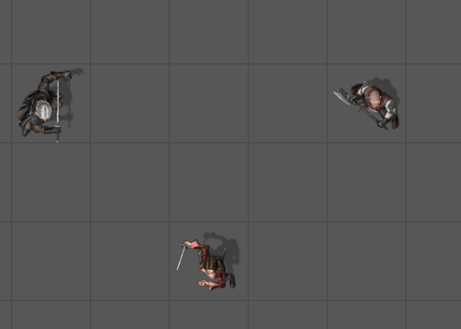
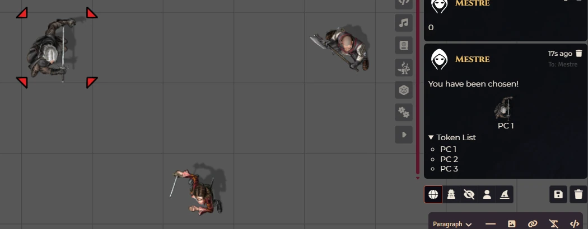
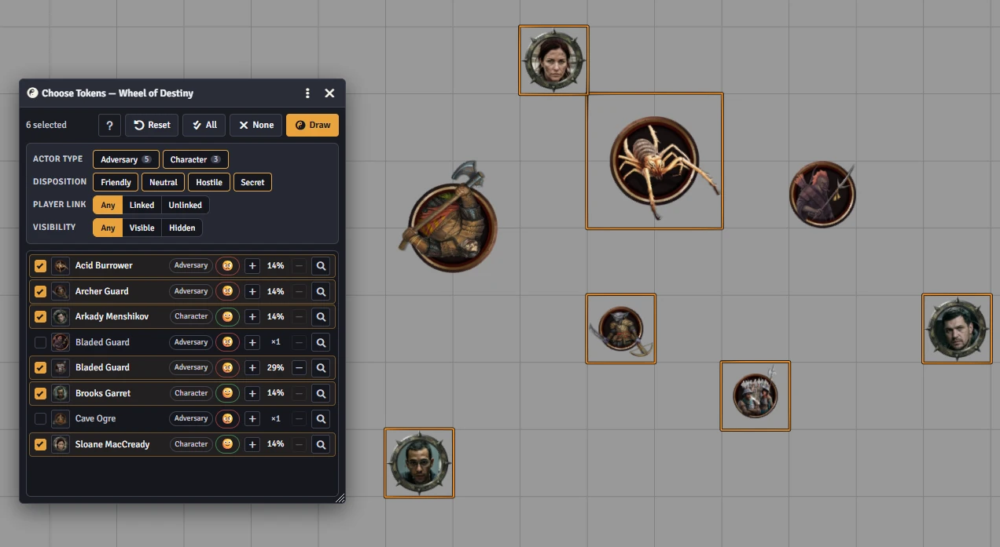
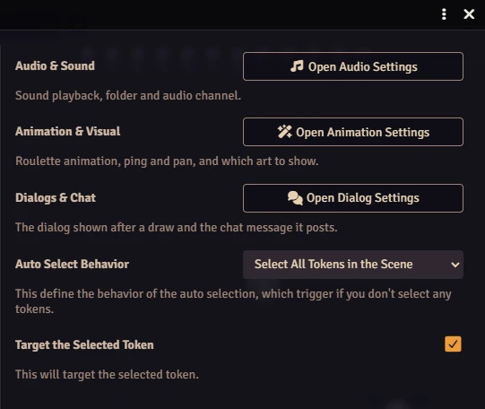

# ☯ Wheel of Destiny

**Let fate pick the victim.**

Something bad is about to happen to someone in the room. But you don't want to be the one who chose. Let the **Wheel of Destiny** spin. It wasn't your fault — it was the damn computer.

One click, and the module randomly picks a token: it glows on the canvas, the wheel spins, a sound plays, and the chosen one is revealed to the whole table.

<p align="center">
  
</p>

[](https://buymeacoffee.com/mestredigital) [](https://mestredigital.online/pages/projetos-en)

## ✨ What It Does

- 🎯 **Picks a random token for you.** Select a few tokens and it draws from those. Select nothing and it opens a picker listing every token in the scene, so you choose exactly who's in the draw.
- 🔍 **Filters the scene for you.** The picker filters by actor type, disposition, whether a player is linked to the actor, and whether the token is hidden. Click **Hostile** and only the hostiles are in the draw — no hunting through the list.
- 🖱️ **Or just click tokens on the map.** While the picker's open, canvas and list stay in sync — control a token to add it to the draw, release it to drop it, and the filters widen automatically to let it in.
- 🔄 **Keeps up with the scene.** Add a token, delete one, or change its name or disposition with the picker open and the list updates itself — without losing the pool you had already built.
- ⚖️ **Load the dice.** Some victims are more deserving than others. Give a token extra chances with **+** and the picker shows everyone's live odds — the brute swings at whoever's in his face, but there's still a chance he goes for the guy who insulted his mother.
- 🎡 **Spins a roulette.** An optional "Native Glow" animation hops from token to token on the canvas before locking onto the winner. No extra modules needed.
- 🔊 **Plays a random sound.** Point it at a folder of sounds and it picks one at random every spin. An evil laugh is included to get you started.
- 💬 **Announces the result in chat.** Keep it as a secret whisper to the GM, or show the whole table who got picked.
- 🖼️ **Reveals the chosen one on screen.** A fullscreen image of the token pops up for **everyone** — and fades away on its own after a few seconds.
- 📍 **Targets and pings the winner.** The camera pans to the token so nobody misses the moment.
- 🧩 **Zero dependencies.** No Sequencer, no JB2A, no socketlib. Install it and go.
- 👥 **Players can use it too.** A player targets a few tokens, hits the button, and the wheel picks from their targets.

The wheel stops, the winner gets targeted, and the verdict lands in chat — with the full list of who was in the draw, if you want it:

<p align="center">
  
</p>

## 🚀 How To Use

Three ways to spin:

- **The button.** Open the **Token** controls in the left toolbar and click the ☯ yin-yang button.
- **The keyboard.** Press **F** to spin, or **Shift+F** to always open the token picker — even when you already have tokens selected. Both shortcuts are GM-only and can be rebound under **Configure Controls**.
- **A macro.** See the [Macros & API](#-macros--api) section below.

**Who gets drawn?**

| What you do | Who's in the draw |
|---|---|
| You select two or more tokens first | Only the tokens you selected |
| You select nothing, or just one (GM) | Whoever you pick in the **Choose Tokens** window |
| You're a player | Only the tokens you have targeted |

### 🎛️ The Choose Tokens window

Start a draw without staging a selection and this opens, listing every token in the scene with its art, name, actor type, disposition, and the player linked to it. It reopens wherever you last left it — position, size, and filters included.

<p align="center">
  
</p>

**The filters are how you build the draw.** It opens with the whole scene in, and narrowing a filter drops whatever no longer matches — click **Hostile** and every non-hostile leaves the draw. Four filters, all read from the current scene:

| Filter | What it does |
|---|---|
| **Actor Type** | Built from the types actually in the scene, so your system's own types show up with a count each |
| **Disposition** | Friendly 🙂, Neutral 😐, Hostile 😠, Secret 🎭 |
| **Player Link** | Whether the token's actor belongs to a Foundry user |
| **Visibility** | Visible or hidden tokens |

If your remembered filters would leave nothing to pick from in the current scene, they reset to their defaults instead of opening onto an empty draw.

Need an exception to the filters? Untick any token by hand — or click it right on the canvas. While the window is open, canvas and picker selection track each other: controlling a token on the map ticks its row, widening whatever filter was hiding it if needed, and releasing it unticks the row again. Shift+click adds or removes a token without losing the rest of your canvas selection; a plain click replaces it, same as it always has. Each row also has a 🔍 button to pan the camera straight to that token. **All** and **None** work on what's currently shown, **Reset** puts every filter back, and **Draw** spins with whatever's left.

**The list follows the scene.** Drop a token on the map with the window open and it shows up in the list; if it passes your current filters it joins the draw straight away. Delete one and it leaves. Rename a token, hide it, or flip its disposition and its row updates to match. Whatever you had already set stays put — rows you unticked by hand stay unticked, and every chance you assigned is kept.

**Not everyone has to be equally likely.** Every row ends in a chance column — **+**, the odds, **−**. Each token starts with one chance and an even share of the draw; **+** gives it another, **−** takes one back, and the percentages of everyone in the draw are recalculated on the spot. Three chances against one other token is a 75% chance of being picked, and that is exactly what the column will say.

| | |
|---|---|
| **+** | One more chance in the draw |
| **%** | This token's live odds, against everyone currently ticked |
| **−** | One less chance, down to a floor of one |

A row that is not in the draw shows what it is worth (`×3`) instead of a percentage, so nothing you set is lost when you untick it or filter it out — tick it back and its chances count again. The buttons only ever change that number: they never add a token to the draw or drop it from one, which is what the checkbox, the filters and the canvas are for. Chances last as long as the window does — every draw starts fresh, with nobody favored. **Reset** clears them too, along with the filters.

## ⚙️ Settings

<p align="center">
  
</p>

One setting sits right in the main module tab, because it's the one you'll actually change mid-game:

- **Target the Selected Token** — automatically target whoever gets picked.

Everything else lives behind three tidy buttons:

- 🎵 **Audio & Sound** — turn sound on, choose your sound folder, pick which audio channel it plays on (so players control the volume in their own Foundry mixer), and hit **Preview Sound** to try a folder before you commit to it.
- ✨ **Animation & Visual** — enable the roulette animation, tune its speed (**Animation Delay** per step) and set a **Max Total Duration** so the animation never drags on too long regardless of how many tokens are in the draw (if the per-step delay would exceed the total cap, it is reduced automatically), ping and pan to the winner, show the full list of candidates in chat, and choose whether to display the **token art** or the **actor sheet art**.
- 💬 **Dialogs & Chat** — turn the fullscreen reveal on or off, write your own dramatic line ("You have been chosen!"), and decide who sees the chat message: nobody, the GM only, or the whole table.

## 🧙 Macros & API

You can trigger the Wheel of Destiny from a macro or from another module:

**Spin the wheel — exactly like clicking the button.**

```js
WoD.randomToken();
```

**Open the token picker, then spin with whatever you choose.** GM only.

```js
WoD.openTokenPicker();
```

**Spin using your own list of tokens.** Runs the full show (animation, sound, chat, reveal) and returns the winner.

```js
const mySelectedToken = await WoD.randomToken(myTokenList);
```

**Spin with your own odds.** Same thing, but some tokens get more than one chance — keyed by token id, exactly like the picker's chance column. Anything you leave out gets a single chance.

```js
const mySelectedToken = await WoD.randomToken(myTokenList, {
  weights: { [bigBad.id]: 5, [theRogue.id]: 3 }   // a Map works too
});
```

**Just pick one, no bells and whistles.** Returns a token from your list and nothing else happens. Takes the same optional weights.

```js
const mySelectedToken = WoD.selectRandomToken(myTokenList);
const loadedPick = WoD.selectRandomToken(myTokenList, { [bigBad.id]: 5 });
```

**Ask for a list of tokens without spinning.** Opens the picker and hands back what you chose, or `null` if you closed it. GM only.

```js
const myTokenList = await WoD.promptForTokens();
```

**Ask for the pool *and* the chances the GM set on it.** Same picker, but nothing is thrown away — hand both straight to `randomToken`. GM only.

```js
const pool = await WoD.promptForPool();      // { tokens, weights } or null
if (pool) await WoD.randomToken(pool.tokens, { weights: pool.weights });
```

> ⚠️ **Coming from an older version?**
> - **v0.4.3** removed the auto-select mode. `WoD.customAutoSelectDialog()` is gone — use `WoD.openTokenPicker()`. `WoD.randomToken()` also lost its second argument: `WoD.randomToken([], 'pcs')` no longer filters, and the `'pcs'` is ignored. Pass your own token list instead, or use the picker's filters.
> - **v0.4.0** moved the API from `game.wod` to the global `WoD`. Old macros using `game.wod.randomToken()` need to be updated to `WoD.randomToken()`.

## 📦 Installation

Search for **Wheel of Destiny** in Foundry's module browser, or paste this manifest URL:

```
https://raw.githubusercontent.com/brunocalado/wheel-of-destiny/main/module.json
```

Requires **Foundry VTT v14**. No other modules needed.

## 💬 Community

- Got an idea to make this module better? [Share it!](https://github.com/brunocalado/wheel-of-destiny/issues)
- Found a bug? [Report it!](https://github.com/brunocalado/wheel-of-destiny/issues)

## 📜 Changes

You can see what's new at the [CHANGELOG](CHANGELOG.md).

## 🙏 Acknowledgements

- Roll of Fate module. R.I.P.
- @PepijnMC
- @tiowidow
- [Luber](https://github.com/luizrcb)

## 📄 Licenses

- Code license at [LICENSE](LICENSE).
- Assets license at [LICENSE](docs/LICENSE_ASSETS.md).